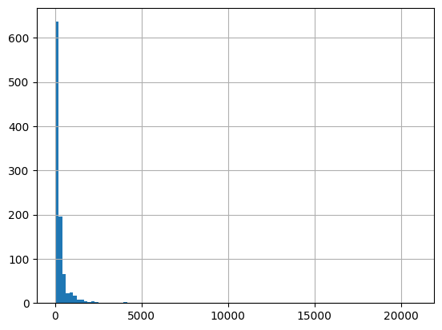

# Recommendation Engine for the Coppermind Wiki

## Introduction

This is a recommendation engine for the [Coppermind Wiki](https://coppermind.net/wiki/Main_Page), a fan wiki page on the topic of american author Brandon Sanderson and his books. It is based on the
[Tf-Idf](https://en.wikipedia.org/wiki/Tf%E2%80%93idf) algorithm. The engine is written in Python and uses the [scikit-learn](https://scikit-learn.org/stable/) library
for the Tf-Idf implementation.

## Usage

To use the recommendation engine, you need to have Python 3 installed. You can then install the required dependencies
using poetry:

```bash
poetry install
```

or pip:

```bash
pip install -r requirements.txt
```

Afterward, you can run the recommendation engine using the following command:

```bash
python main.py history_file [-o output_file] [-k number_of_recommendations] [-v verbose]
```

The history file is a JSON file containing the history of a user. The output file is a JSON file containing the
recommendations. The number of recommendations is optional and defaults to 10. The verbose flag is also optional and
prints additional information to the console.

## History File

The history file is a JSON file containing the history of a user. The history is a list of pages the user has visited 
represented by their title.

```json
[
  "Summary:The Way of Kings",
  "Summary:Words of Radiance",
  "Kaladin"
]
```

An example history file is provided in the repository.

## The Algorithm

The algorithm is based on the [Tf-Idf](https://en.wikipedia.org/wiki/Tf%E2%80%93idf) algorithm. It is implemented using
the [scikit-learn](https://scikit-learn.org/stable/) library. The algorithm is trained using a corpus of pages. The
corpus of pages was scraped from the Coppermind Wiki using the [scrapy](https://scrapy.org/) library. The corpus contains
the title and the content of each page.

1,000 pages were scraped from the Coppermind Wiki. Each page was preprocessed using [nltk](https://www.nltk.org/) library.
The preprocessing steps are tokenization, stop word removal, and stemming. The Tf-Idf algorithm was then trained using the preprocessed pages. The
trained algorithm is then used to calculate the similarity between each page in the corpus and the history of the user. 

Recommendations generated from each page are combined using reciprocal rank fusion. The recommendations are then sorted
by their score and the top k recommendations are returned.

### Creation Steps:

1. Scraped 1000 wiki pages from the Coppermind Wiki, ignoring pages outside the domain and not related to the scraping, like user pages or discussions.
2. Used NLTK Porter Stemmer, word tokenizer and english stopwords set to clean the articles. For each article, removed non-letters from it using regex
and lowercase each word.
3. Used Scikit-learn Tf-Idf implementation to build the vector index

### Inference Steps:

1. Main script takes a JSON file with an array of articles as an input
2. For each article in user history it calculates a cosine similarity with articles outside of history, thus for each article receiving an ordered list of
similar articles
3. Ranked lists are combined using the reciprocal rank fusion algorithm
4. Finally, the script returns k top recommended articles, either to standard output or to a given file

## Interesting Facts

- The algorithm is trained using 1,000 pages from the Coppermind Wiki.
- There are 11,945 unique words in the corpus.
- Most articles in the corpus are rather short, with the average number of tokens being 342.
- Shortest article after preprocessing has just 5 tokens ([Drenya](https://coppermind.net/wiki/Drenya)), 
and the longest over 20,000 ([Summary of The Words of Radiance](https://coppermind.net/wiki/Words_of_Radiance/Summary)).
- The most common word in the corpus is 'kaladin', which appears 3,330 times and is the name of the main character in the Stormlight Archive series.
- The least common word in the corpus is 'ador' which appears only once and is a stemmed version of the word 'adore'.
- The most similar articles to the article 'Kaladin' are summaries of the first two books in the Stormlight Archive series (The Way of Kings and Words of Radiance).
- The least similar article to the article 'Kaladin' is the article regarding the [Kadrix isle](https://coppermind.net/wiki/Kadrix), which is a large island in the world of Roshar.

- Histogram of the number of tokens in the corpus:
